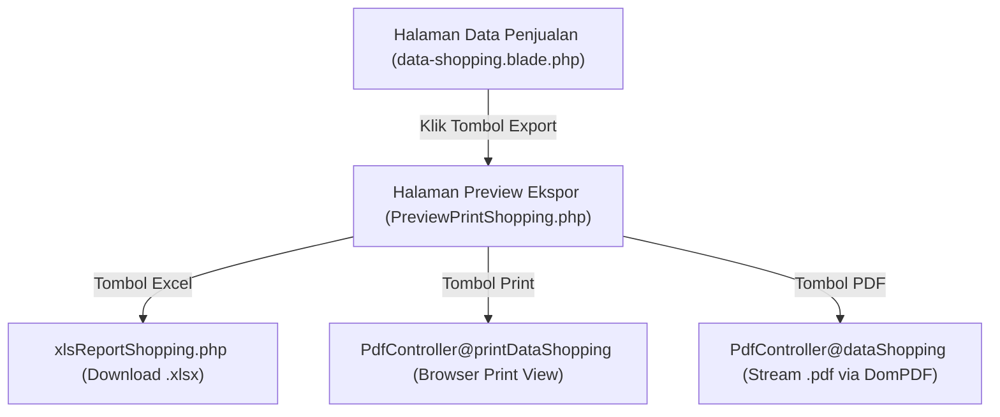

# Rencana Implementasi: Fitur Ekspor Data Penjualan (PDF, Excel, & Print)

Dokumen ini merinci rencana teknis untuk melengkapi menu **Data Penjualan** dengan fitur ekspor **PDF**, **Excel**, dan **Print Preview**, dengan arsitektur dan pola antarmuka yang disamakan persis seperti pada menu **Data Produk**.

---

## 1. Analisis Kebutuhan & Pola Eksisting (*Existing Pattern*)

Pada menu **Data Produk**, fitur ekspor dirancang dengan alur berikut:
1. Tombol **Export** (`btn btn-success`) pada halaman utama Data Produk mengarah ke route `kasir.product.export`.
2. Halaman preview khusus ([`PreviewPrintProduct.php`](file:///d:/!%60Learn-Programmer%60/KasirApp/app/Livewire/Product/PreviewPrintProduct.php) & [`preview-print-product.blade.php`](file:///d:/!%60Learn-Programmer%60/KasirApp/resources/views/livewire/product/preview-print-product.blade.php)) menampilkan tabel data produk beserta 3 tombol aksi di *card-header*:
   - **Excel**: Mengunduh file `.xlsx` melalui [`xlsReportProduct.php`](file:///d:/!%60Learn-Programmer%60/KasirApp/app/Exports/xlsReportProduct.php) (`Maatwebsite/Excel`).
   - **Print**: Membuka tampilan cetak thermal/A4 di tab baru dengan auto-trigger `window.print()`.
   - **PDF**: Menghasilkan dokumen PDF terformat rapi via `barryvdh/laravel-dompdf`.

Pada menu **Data Penjualan** saat ini:
- Tombol `Laporan` di card-header [`data-shopping.blade.php`](file:///d:/!%60Learn-Programmer%60/KasirApp/resources/views/livewire/transaction/data-shopping.blade.php) masih memiliki `href=""` kosong.
- Belum tersedia komponen preview ekspor, export class Excel, maupun template PDF untuk rekap penjualan.

---

## 2. Arsitektur Komponen yang Akan Dibuat



---

## 3. Rincian Perubahan Kode (*Proposed Changes*)

### A. Modul Transaksi & Livewire (`app/Livewire/Transaction/`)

#### [NEW] `app/Livewire/Transaction/PreviewPrintShopping.php`
- Membuat komponen Livewire baru untuk halaman preview ekspor transaksi penjualan.
- Mengambil data transaksi lengkap dengan relasi: `Shopping::with(['user', 'details.product'])->latest()->get()`.
- Mengimplementasikan penanganan role `$isAdmin = Auth::user()->role == 'Admin'` untuk judul dan navigasi breadcrumb.
- Merender view `livewire.transaction.preview-print-shopping` dengan layout `layouts.app`.

#### [NEW] `resources/views/livewire/transaction/preview-print-shopping.blade.php`
- Menyediakan antarmuka tabel rekap penjualan yang bersih dan responsif.
- Memasang 3 tombol aksi pada *card-header*:
  - **Excel**: `route('data.shopping.excel')` (Icon: `fas fa-file-excel`, Class: `btn-success`)
  - **Print**: `route('data.shopping.print')` (Icon: `fas fa-print`, Class: `btn-info`, Target: `_blank`)
  - **PDF**: `route('data.shopping.pdf')` (Icon: `fas fa-file-pdf`, Class: `btn-danger`, Target: `_blank`)
- Kolom tabel: `#`, `No. Invoice`, `Tipe`, `Tanggal`, `Kasir`, `Total Penjualan`, `Bayar`, `Kembalian`.

#### [MODIFY] `resources/views/livewire/transaction/data-shopping.blade.php`
- Mengubah tombol baris 69-71 dari `<a href="" class="btn btn-success"><i class="fas fa-print mr-1"></i> Laporan</a>` menjadi:
  ```blade
  <a href="{{ route('kasir.shopping.export') }}" class="btn btn-success" rel="noopener noreferrer">
      <i class="fas fa-file-export mr-1"></i> Export
  </a>
  ```

---

### B. Modul Ekspor Excel (`app/Exports/`)

#### [NEW] `app/Exports/xlsReportShopping.php`
- Mengimplementasikan interface Maatwebsite Excel: `FromCollection`, `WithHeadings`, `WithMapping`, `WithColumnFormatting`, `ShouldAutoSize`, `WithColumnWidths`.
- Mengambil koleksi `Shopping::with(['user', 'details.product'])->latest()->get()`.
- Header kolom:
  `['No', 'Invoice', 'Tipe Penjualan', 'Tanggal Transaksi', 'Kasir', 'Total Belanja', 'Nominal Bayar', 'Kembalian']`
- Formatting angka mata uang Rupiah pada kolom Total, Bayar, dan Kembalian (`"Rp"#,##0.00`).

---

### C. Modul Cetak & PDF (`app/Http/Controllers/Export/` & `resources/views/pdf/`)

#### [MODIFY] `app/Http/Controllers/Export/PdfController.php`
Menambahkan 3 method controller baru:
1. `dataShopping()`:
   - Mengambil data transaksi penjualan.
   - Memanggil `Pdf::loadView('pdf.data-shopping', ['data' => $data, 'isPdf' => true])->setPaper('a4', 'portrait')`.
   - Mengembalikan `return $pdf->stream('Laporan-Penjualan.pdf')`.
2. `printDataShopping()`:
   - Mengembalikan view `pdf.data-shopping` dengan opsi `'isPdf' => false` untuk memicu dialog cetak browser otomatis.
3. `dataShoppingExcel()`:
   - Memanggil `Excel::download(new xlsReportShopping(), 'Data-Penjualan.xlsx')`.

#### [NEW] `resources/views/pdf/data-shopping.blade.php`
- Template cetak laporan transaksi bergaya struk/tabel monospaced formal.
- Header laporan: Judul "LAPORAN PENJUALAN", Tanggal Cetak, Total Transaksi, Total Akumulasi Omset Penjualan.
- Tabel transaksi rapi dengan footer total omset.
- Script JavaScript bawaan untuk memicu cetak otomatis jika dibuka mode print browser (`window.onload = function() { window.print(); };`).

---

### D. Konfigurasi Rute (`routes/web.php`)

#### [MODIFY] `routes/web.php`
1. Menambahkan import class Livewire:
   ```php
   use App\Livewire\Transaction\PreviewPrintShopping;
   ```
2. Mendaftarkan route halaman preview ekspor di dalam grup bersama (Admin & Kasir):
   ```php
   Route::get('/kasir/shopping/export', PreviewPrintShopping::class)->name('kasir.shopping.export');
   ```
3. Mendaftarkan 3 route download/print:
   ```php
   Route::get('/download/pdf/data-shopping', [PdfController::class, 'dataShopping'])->name('data.shopping.pdf');
   Route::get('/print/data-shopping', [PdfController::class, 'printDataShopping'])->name('data.shopping.print');
   Route::get('/download/excel/data-shopping', [PdfController::class, 'dataShoppingExcel'])->name('data.shopping.excel');
   ```

---

## 4. Rencana Pengujian & Verifikasi (*Verification Plan*)

### Automated Tests
1. **Membuat File Pengujian Baru**: `tests/Feature/ShoppingExportTest.php`
   - Test akses route preview ekspor `kasir.shopping.export` mengembalikan status 200.
   - Test akses route cetak browser `data.shopping.print` mengembalikan status 200.
   - Test akses route stream PDF `data.shopping.pdf` mengembalikan response berkas PDF.
   - Test akses route Excel `data.shopping.excel` menghasilkan file unduhan.
2. **Menjalankan Seluruh Test Suite**:
   ```bash
   php artisan test
   ```
   Memastikan seluruh tes lama dan baru lulus 100%.

### Manual Verification
1. Buka menu **Data Penjualan** di browser.
2. Klik tombol hijau **Export** di kanan atas.
3. Pastikan halaman preview terbuka dengan tabel rekap transaksi.
4. Klik tombol **Excel** $\rightarrow$ pastikan file `.xlsx` terunduh dan data transaksi sesuai.
5. Klik tombol **Print** $\rightarrow$ pastikan tab cetak terbuka dengan preview tabel dan dialog print aktif.
6. Klik tombol **PDF** $\rightarrow$ pastikan dokumen PDF terbuka rapi dengan header dan footer total omset.
