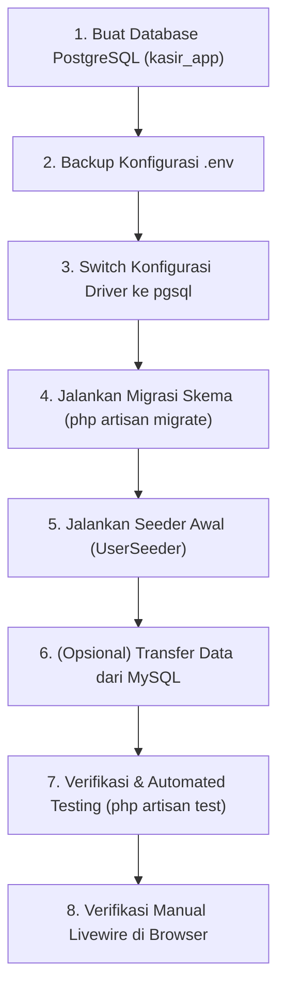

# Rencana Migrasi Database: MySQL ke PostgreSQL (Migration Plan)

- **Status**: `Completed` / `Selesai Diimplementasikan` ✅
- **Kategori**: `Database Infrastructure`, `Architecture`, `DevOps`
- **Target Driver**: PostgreSQL 18 (`pgsql`)
- **Driver Asal**: MySQL 8.4 (`mysql`)
- **Tanggal Dibuat**: 01 Oktober 2026

---

## 1. Analisis Kesiapan Lingkungan (*Environment Readiness Assessment*)

Berdasarkan audit sistem lokal saat ini:

| Komponen | Status Saat Ini | Keterangan |
| :--- | :---: | :--- |
| **PHP Extension** | ✅ **Aktif** | `pdo_pgsql` dan `pgsql` telah terpasang dan aktif di PHP 8.3.33 Laragon. |
| **PostgreSQL Service** | ✅ **Aktif** | Layanan Windows `postgresql-x64-18` sedang berjalan (*Running*) pada port `5432`. |
| **PostgreSQL Client** | ✅ **Tersedia** | `psql.exe` versi 18.0.1.0 tersedia di `C:\Program Files\PostgreSQL\18\bin\psql.exe`. |
| **Otentikasi Akun** | ✅ **Terverifikasi** | User `postgres` terbukti dapat terhubung tanpa kendala otentikasi. |
| **Audit Kode Aplikasi** | ✅ **Aman** | Tidak ditemukan query MySQL-spesifik (`DB::raw` / `whereRaw`). Seluruh model menggunakan Eloquent ORM & Query Builder standar. |

---

## 2. Tahapan Eksekusi Rencana Migrasi (*Step-by-Step Execution Plan*)



---

### Tahap 1: Pembuatan Database di PostgreSQL
Membuat database baru bernama `kasir_app` di PostgreSQL server:
```powershell
& 'C:\Program Files\PostgreSQL\18\bin\psql.exe' -U postgres -c "CREATE DATABASE kasir_app ENCODING 'UTF8';"
```

---

### Tahap 2: Konfigurasi Environment (`.env`)
Menyesuaikan konfigurasi database pada file [`.env`](file:///d:/!%60Learn-Programmer%60/KasirApp/.env):

```env
# Konfigurasi Baru (PostgreSQL)
DB_CONNECTION=pgsql
DB_HOST=127.0.0.1
DB_PORT=5432
DB_DATABASE=kasir_app
DB_USERNAME=postgres
DB_PASSWORD=brew_island
```

> **Catatan**: Backup nilai konfigurasi MySQL sebelumnya agar mudah jika ingin beralih (*fallback*).

---

### Tahap 3: Eksekusi Migrasi Skema Tabel
Menjalankan migrasi seluruh 18 file migrasi ke PostgreSQL:
```bash
php artisan migrate:fresh
```

#### Poin yang Diantisipasi pada Migrasi PostgreSQL:
1. **Tipe Data `ENUM`**:
   - Di PostgreSQL, Laravel secara otomatis memetakan `$table->enum(...)` ke tipe `VARCHAR(255)` dengan `CHECK` constraint.
2. **Klausa `->after(...)`**:
   - PostgreSQL secara arsitektural tidak mendukung pengurutan posisi kolom (`AFTER column_name`). Laravel 11 mengabaikan instruksi `->after()` secara aman pada driver PostgreSQL tanpa menimbulkan error.
3. **Primary Key Auto-Increment**:
   - Menggunakan tipe `BIGSERIAL` / `IDENTITY` bawaan PostgreSQL.

---

### Tahap 4: Seeding Data Awal
Mengisi user administrator dan kasir awal:
```bash
php artisan db:seed --class=UserSeeder
```
Data akun yang dibuat:
- **Admin**: `admin@example.com` / `Admin123` (Kode: `ADM001`)
- **Kasir**: `kasir@example.com` / `Kasir123` (Kode: `KSR001`)

---

### Tahap 5: Opsi Migrasi Data Eksisting (*Data Transfer*)
Pilih salah satu dari 2 skenario:
- **Skenario A (Pengembangan Baru / Fresh Start)**:
  - Cukup jalankan `UserSeeder`. Bahan dan produk diinput ulang melalui UI kasir/admin.
- **Skenario B (Transfer Data dari MySQL ke PostgreSQL)**:
  - Jika ada data bahan baku, resep, atau transaksi penjualan di MySQL yang ingin dipertahankan, kita buatkan skrip artisan command `php artisan db:migrate-mysql-to-pgsql` yang memindahkan data per tabel dengan urutan:
    1. `users`
    2. `categories`
    3. `products`
    4. `bahans`
    5. `product_bahan`
    6. `shoppings` & `shopping_details`
    7. `bahan_stock_movements`
    8. `target_sales`, `labors`, `overheads`

---

### Tahap 6: Pengujian Otomatis & Manual (*Validation*)

1. **Automated Testing**:
   Jalankan test suite untuk memastikan fungsi backend dan ORM berjalan mulus di PostgreSQL:
   ```bash
   php artisan test
   ```
2. **Manual Testing Halaman Utama**:
   - Login sebagai Admin & Kasir.
   - Tambah data master bahan & mutasi stok di modul `Material`.
   - Tambah produk & tentukan resep komposisi di modul `Product`.
   - Lakukan transaksi kasir di modul `Transaction` dan pastikan stok bahan terpotong.
   - Atur target penjualan, tenaga kerja, biaya operasional, dan cek kalkulasi HPP di modul `Operational`.

---

## 3. Rencana Cadangan (*Rollback Plan*)

Jika terjadi kendala saat pengujian dengan PostgreSQL, pengembalian ke MySQL dapat dilakukan secara instan dalam 1 langkah tanpa kehilangan data:
1. Ubah kembali file [`.env`](file:///d:/!%60Learn-Programmer%60/KasirApp/.env):
   ```env
   DB_CONNECTION=mysql
   DB_HOST=127.0.0.1
   DB_PORT=3306
   DB_DATABASE=kasir_app
   DB_USERNAME=root
   DB_PASSWORD=
   ```
2. Jalankan `php artisan config:clear`. Database MySQL di Laragon tetap aktif dan utuh seperti semula.

---

## 4. Checklist Persetujuan & Eksekusi

- [x] Konfirmasi skenario: Fresh Start (Database bersih di PostgreSQL).
- [x] Konfigurasi password PostgreSQL (`brew_island`).
- [x] Pembuatan database `kasir_app` di PostgreSQL 18.
- [x] Eksekusi `php artisan migrate:fresh --seed` (Seluruh 18 tabel + UserSeeder, CategorySeeder, ProductSeeder).
- [x] Validasi Automated Testing (`php artisan test` - 20 passed, 0 failures).
- [x] Validasi HTTP Server (`http://127.0.0.1:5000/login` - Status 200 OK).
