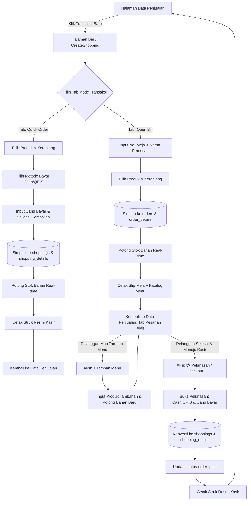

# Rencana Implementasi: Fitur Pesanan Ditangguhkan (Dine-In / Open Bill) & Bayar di Akhir

## Deskripsi Fitur
Fitur ini menambahkan metode transaksi kedua pada cafe **Brew Island**:
1. **Metode 1 (Quick Order / Bayar Langsung)**: Pelanggan pesan menu, langsung bayar di kasir (Cash/QRIS), pesanan diproses, struk kasir resmi tercetak.
2. **Metode 2 (Open Bill / Pesan Meja / Bayar Nanti)**: Pelanggan pesan menu awal, memilih No. Meja/No. Urut dan Nama Pemesan. Pesanan disimpan sebagai **Pesanan Aktif**.
   - Stok bahan baku langsung terpotong saat pesanan dibuat (agar sinkron dengan bahan yang dipakai barista/dapur secara real-time).
   - Kasir mencetak **Slip Meja Sementara** yang memuat No. Meja, Nama Pemesan, Brand Brew Island, dan **Katalog Produk Tersedia beserta Harganya** sebagai referensi pelanggan jika ingin memesan menu tambahan selama nongkrong.
   - Pelanggan dapat menambah pesanan kapan saja (**Add-on Order**).
   - Saat hendak pulang/selesai nongkrong, kasir melakukan **Pelunasan (Checkout)**, menginput pembayaran Cash/QRIS, pesanan otomatis dikonversi menjadi data penjualan resmi (**`shoppings`**), dan Struk Pembayaran Kasir resmi dicetak.

---

## User Review Required

> [!IMPORTANT]
> **Keputusan Desain & Perubahan Alur yang Telah Disepakati:**
> 1. **Transaksi Baru Menggunakan Halaman Khusus (Bukan Modal Pop-up)**:
>    - Tombol "Transaksi Baru" di halaman *Data Penjualan* akan mengarahkan ke halaman baru: `/kasir/shopping/create` (Komponen Livewire `CreateShopping`).
>    - **Alasan**: Mencegah insiden modal tertutup secara tidak sengaja saat kasir mengklik di luar modal (backdrop click) yang dapat menghilangkan keranjang input, serta memberikan area kerja yang luas, nyaman, dan leluasa bagi kasir.
>    - Tampilan halaman ini mengadopsi layout sistem Stisla yang sudah ada, dengan card kerja yang terstruktur rapi.
> 2. **Tab Pilihan Mode Transaksi di Halaman Transaksi Baru**:
>    - Di bagian atas halaman `CreateShopping`, kasir dapat memilih dengan jelas antara:
>      - **Tab 1: ⚡ Quick Order (Bayar Langsung di Tempat)**
>      - **Tab 2: 🍽️ Open Bill (Pesan Meja / Bayar Nanti)**
> 3. **Skema Database Tabel Terpisah**: Dibuat tabel baru `orders` & `order_details` khusus untuk pesanan aktif cafe. Saat pelunasan di kasir, data ini dikonversikan ke tabel penjualan `shoppings` & `shopping_details`.
> 4. **Pemotongan Stok Bahan Baku Real-Time**: Stok bahan baku langsung dipotong saat pesanan disimpan ke meja (dan saat ada menu tambahan), agar data stok bahan di dapur/bar real-time.
> 5. **Slip Meja Sementara**: Memuat identitas meja & pemesan, serta **daftar katalog produk tersedia & harga** sebagai referensi pelanggan untuk memesan lagi.

---

## Diagram Alur Transaksi



---

## Rincian Perubahan Teknis

### 1. Database & Migrations

#### [NEW] `database/migrations/2026_01_17_100000_create_orders_table.php`
- Membuat tabel `orders`:
  - `id` (bigIncrements)
  - `order_code` (string, unique) -> e.g. `ORD-20261010-0001`
  - `table_number` (string) -> e.g. "Meja 05" atau "05"
  - `customer_name` (string) -> e.g. "Budi"
  - `user_id` (foreignId to `users`) -> Kasir yang melayani
  - `shopping_id` (foreignId to `shoppings`, nullable) -> Diisi saat transaksi dilunasi
  - `total_price` (bigInteger)
  - `status` (enum/string: `'pending'`, `'paid'`, `'canceled'`) -> Default `'pending'`
  - `notes` (text, nullable)
  - `timestamps`

#### [NEW] `database/migrations/2026_01_17_100001_create_order_details_table.php`
- Membuat tabel `order_details`:
  - `id` (bigIncrements)
  - `order_id` (foreignId to `orders`, cascade on delete)
  - `product_id` (foreignId to `products`)
  - `qty` (integer)
  - `price` (bigInteger)
  - `subtotal` (bigInteger)
  - `material_cost` (decimal 12,2) -> Snapshot HPP bahan baku
  - `timestamps`

---

### 2. Eloquent Models

#### [NEW] app/Models/Order.php
- Fillable: `order_code`, `table_number`, `customer_name`, `user_id`, `shopping_id`, `total_price`, `status`, `notes`.
- Relasi: `user()`, `shopping()`, `details()`.
- Scopes: `scopePending($query)`, `scopePaid($query)`, `scopeCanceled($query)`.

#### [NEW] app/Models/OrderDetail.php
- Fillable: `order_id`, `product_id`, `qty`, `price`, `subtotal`, `material_cost`.
- Relasi: `order()`, `product()`.

#### [MODIFY] app/Models/Shopping.php
- Tambahkan relasi `order()`:
  ```php
  public function order()
  {
      return $this->hasOne(Order::class, 'shopping_id');
  }
  ```

---

### 3. Routing (`routes/web.php`)

#### [MODIFY] routes/web.php
- Tambahkan rute untuk halaman Transaksi Baru:
  ```php
  Route::middleware(['RoleUser:Admin,Kasir'])->prefix('dashboard')->group(function () {
      // ... rute existing
      Route::get('/kasir/shopping', DataShopping::class)->name('kasir.shopping');
      Route::get('/kasir/shopping/create', CreateShopping::class)->name('kasir.shopping.create');
      Route::get('/kasir/shopping/export', PreviewPrintShopping::class)->name('kasir.shopping.export');
  });
  ```

---

### 4. Komponen Halaman Transaksi Baru (`CreateShopping`)

#### [NEW] `app/Livewire/Transaction/CreateShopping.php`
- **State & Properties**:
  - `public $order_mode = 'quick';` // `'quick'` (Quick Order) atau `'open_bill'` (Open Bill Meja)
  - `public $table_number = '';`
  - `public $customer_name = '';`
  - `public $sales_type = 'offline';` // `'offline'` atau `'online'`
  - `public $cart = [];` // `productId => ['id', 'name', 'price', 'qty']`
  - `public $payment_method = 'cash';`
  - `public $pay = 0;`
  - `public $total_price = 0;`
  - `public $change = 0;`
  - `public $qris_confirmed = false;`
  - `public $notes = '';`
  - `public $showSlipModal = false;`
  - `public $createdOrder = null;`
- **Metode Utama**:
  - `setOrderMode($mode)`: Beralih antara tab Quick Order dan Open Bill.
  - `addToCart($productId)`, `removeFromCart($productId)`, `updateQty($productId, $qty)`.
  - `storeQuickOrder()`:
    - Validasi pembayaran tunai / QRIS.
    - Validasi stok bahan baku mencukupi.
    - Simpan ke `shoppings` & `shopping_details`.
    - Potong stok bahan baku secara real-time via `BahanStockMovement`.
    - Set flash message & redirect ke `kasir.shopping` dengan instruksi cetak struk kasir.
  - `storeOpenBill()`:
    - Validasi: `table_number` (wajib), `customer_name` (wajib), keranjang minimal 1 item.
    - Validasi stok bahan baku mencukupi.
    - Buat `order_code` unik: `ORD-YYYYMMDD-XXXX`.
    - Simpan record `Order` & `OrderDetail`.
    - Potong stok bahan baku secara real-time via `BahanStockMovement` (notes: "Order Meja: {meja} - {nama}").
    - Tampilkan Slip Meja Sementara (lengkap dengan katalog produk untuk pembeli) lalu redirect kembali ke `kasir.shopping` (Tab Pesanan Meja Aktif).

#### [NEW] `resources/views/livewire/transaction/create-shopping.blade.php`
- Halaman mandiri terstruktur rapi:
  - **Header Navigasi**: Breadcrumb + Tombol `[< Kembali ke Data Penjualan]`.
  - **Tab Switcher Besar di Atas**:
    - Tombol Tab: `[⚡ Quick Order (Bayar Langsung)]`
    - Tombol Tab: `[🍽️ Open Bill (Pesan Meja / Bayar Nanti)]`
  - **Layout 2 Kolom**:
    - **Kolom Kiri**: Katalog / Pencarian Produk (Filter kategori, search, daftar card/list produk dengan harga dan tombol tambah).
    - **Kolom Kanan**: Panel Pesanan & Pembayaran (Form Nomor Meja & Nama Pemesan jika mode Open Bill, Daftar Keranjang, Rincian Total, Panel Metode Pembayaran jika Quick Order, dan Tombol Eksekusi Besar).

---

### 5. Komponen Halaman Data Penjualan (`DataShopping`)

#### [MODIFY] app/Livewire/Transaction/DataShopping.php
- **State Properties**:
  - `public $activeTab = 'completed';` // `'completed'` (Riwayat Lunas) atau `'active_orders'` (Pesanan Meja Aktif)
  - `public $selectedOrderId = null;`
  - `public $addonCart = [];` // Keranjang untuk penambahan menu
  - `public $payOrderData = null;`
- **Method Baru**:
  - `switchTab($tab)`: Berpindah antara Riwayat Penjualan dan Pesanan Meja Aktif.
  - `openAddMenuModal($orderId)`: Membuka dialog tambah menu untuk meja yang sedang aktif.
  - `saveAddMenu()`:
    - Menambahkan produk ke `order_details` meja tersebut.
    - Memotong stok bahan baku untuk produk tambahan.
    - Memperbarui `total_price` order meja.
  - `openPayOrderModal($orderId)`: Menyiapkan data pelunasan order meja.
  - `processOrderPayment()`:
    - Validasi pembayaran pelunasan.
    - Buat record penjualan resmi di `shoppings` & `shopping_details`.
    - Update `orders->status = 'paid'` & `shopping_id`.
    - Tampilkan Struk Pembayaran Kasir resmi.
  - `cancelOrder($orderId)`:
    - Rollback stok bahan baku yang sempat dipotong.
    - Update `orders->status = 'canceled'`.

#### [MODIFY] resources/views/livewire/transaction/data-shopping.blade.php
- Ubah tombol `Transaksi Baru` dari modal trigger menjadi link halaman:
  ```blade
  <a href="{{ route('kasir.shopping.create') }}" class="btn btn-warning">
      <i class="fas fa-plus-circle mr-1"></i> Transaksi Baru
  </a>
  ```
- Tambahkan navigasi Tab di atas tabel:
  - Tab 1: **Riwayat Penjualan** (Tabel transaksi `shoppings`).
  - Tab 2: **Pesanan Meja Aktif** (Badge counter: `{{ $activeOrdersCount }} Meja`).
- Tampilan konten Tab Pesanan Meja Aktif:
  - Tabel daftar pesanan meja aktif:
    - No. Meja & Nama Pemesan
    - Jam Pesan & Durasi Nongkrong
    - Daftar Menu Dipesan Sementara
    - Total Tagihan Sementara
    - Tombol Aksi:
      - `[+ Tambah Menu]` (Hijau)
      - `[💳 Bayar / Checkout]` (Biru Primer)
      - `[👁️ Rincian]` (Abu-abu)
      - `[❌ Batalkan]` (Merah)
- Modal Pelunasan Meja (Sederhana & aman khusus untuk checkout pembayaran).
- Modal Tambah Menu Meja (Sederhana khusus untuk add-on).

---

### 6. Desain Cetak Slip Meja Sementara vs Struk Kasir Resmi

1. **Slip Meja Sementara (Dine-in Order Slip)**:
   - Header: Brew Island Coffee
   - **NOMOR MEJA** (Teks besar, jelas, mudah dibaca barista & pelanggan)
   - Nama Pemesan & Waktu Pemesanan
   - Pesan: *"Pesanan Anda sedang disiapkan oleh Barista. Selamat menikmati waktu nongkrong di Brew Island!"*
   - **Katalog Referensi Menu Tersedia & Harga**:
     Daftar ringkas produk-produk cafe yang tersedia beserta harganya agar pelanggan mudah memesan lagi tanpa harus ke kasir.
2. **Struk Pembayaran Kasir Resmi (Payment Receipt)**:
   - Header: Brew Island Coffee & No. Invoice (`INV-YYYYMMDD...`)
   - Tanggal & Nama Kasir
   - No Meja & Nama Pemesan
   - Daftar seluruh item yang dibeli (menu awal + menu tambahan) beserta subtotal
   - Total Harga, Uang Diterima (`Pay`), Uang Kembalian (`Change`), Metode Bayar (`Cash` / `QRIS`)
   - Footer: *"Terima kasih atas kunjungan Anda!"*

---

## Rencana Verifikasi

### Automated Tests
- Menjalankan feature test baru `tests/Feature/DineInOrderWorkflowTest.php`:
  `php artisan test --filter=DineInOrderWorkflowTest`
  - `test_can_access_create_shopping_page()`
  - `test_can_create_quick_order_transaction()`
  - `test_can_create_open_bill_dine_in_order_with_material_deduction()`
  - `test_can_add_menu_to_active_open_bill_order()`
  - `test_can_pay_and_convert_open_bill_to_shopping_transaction()`
  - `test_canceling_order_restores_material_stock()`

### Manual Verification
1. Buka browser di port 5000: Menu **Data Penjualan**.
2. Klik tombol **Transaksi Baru** -> Pastikan membuka halaman baru `/kasir/shopping/create` secara mulus tanpa modal.
3. Uji **Tab Quick Order**: Pilih produk, pilih Cash, masukkan nominal bayar, klik simpan -> Pastikan struk resmi tercetak dan transaksi masuk ke tabel Data Penjualan.
4. Klik **Transaksi Baru** lagi, pilih **Tab Open Bill**:
   - Masukkan No Meja "Meja 03", Nama "Budi".
   - Pilih produk -> Klik Simpan Pesanan Meja.
   - Cek Slip Meja yang muncul (pastikan ada No Meja, Nama, dan referensi daftar produk).
   - Pastikan diarahkan kembali ke Data Penjualan di Tab **Pesanan Meja Aktif**.
5. Di Tab Pesanan Meja Aktif:
   - Klik **+ Tambah Menu** pada Meja 03 -> Tambahkan 1 produk baru -> Pastikan total bertambah dan stok bahan terpotong.
   - Klik **Bayar / Checkout** -> Masukkan uang pembayaran -> Selesaikan -> Pastikan pesanan berpindah ke Riwayat Penjualan lunas dan Struk Kasir Resmi dicetak.
