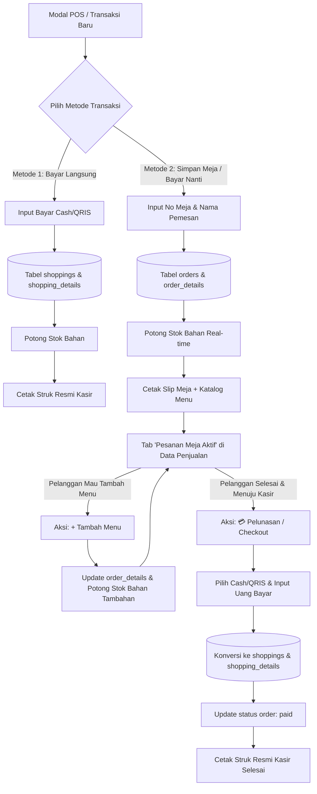

# Rencana Implementasi: Fitur Pesanan Ditangguhkan (Dine-In / Open Bill) & Bayar di Akhir

## Deskripsi Fitur
Fitur ini menambahkan metode belanja kedua pada cafe **Brew Island**:
1. **Metode 1 (Bayar Langsung / Quick Order)**: Pelanggan pesan, bayar langsung di kasir (Cash/QRIS), pesanan diproses, struk resmi tercetak. *(Alur ini tetap dipertahankan 100% tanpa perubahan cara kerja)*.
2. **Metode 2 (Pesan Meja / Bayar Nanti / Open Bill)**: Pelanggan pesan kopi, makanan, dll., memilih No. Meja / No. Urut dan Nama Pemesan. Pesanan disimpan sebagai **Pesanan Aktif**.
   - Stok bahan baku langsung terpotong saat pesanan dibuat (agar sinkron dengan bahan yang dipakai barista/dapur).
   - Kasir mencetak **Slip Meja Sementara** yang memuat No. Meja, Nama Pemesan, dan **Katalog Produk Tersedia beserta Harganya** sebagai referensi pelanggan jika ingin memesan menu tambahan selama nongkrong.
   - Pelanggan dapat menambah pesanan kapan saja (**Add-on Order**).
   - Saat hendak pulang, kasir melakukan **Pelunasan (Checkout)**, menginput pembayaran Cash/QRIS, pesanan otomatis dikonversi menjadi data penjualan resmi (**`shoppings`**), dan Struk Pembayaran Kasir resmi dicetak.

---

## User Review Required

> [!IMPORTANT]
> **Keputusan Desain Utama yang Telah Disepakati Bersama User:**
> 1. **Satu Pintu Navigasi di Data Penjualan**: Tidak membuat menu navigasi baru di sidebar. Halaman Data Penjualan akan memiliki Tab:
>    - **Riwayat Penjualan** (Transaksi Selesai)
>    - **Pesanan Meja Aktif** (dengan badge counter meja yang sedang nongkrong).
> 2. **Skema Database Tabel Terpisah**: Dibuat tabel baru `orders` & `order_details` khusus untuk pesanan aktif cafe. Saat pelunasan di akhir, data ini dikonversikan ke tabel penjualan `shoppings` & `shopping_details`.
> 3. **Pemotongan Stok Bahan Baku**: Stok bahan baku langsung dipotong saat pesanan disimpan ke meja (dan saat ada menu tambahan), agar data stok bahan di dapur/bar real-time.
> 4. **Slip Meja Sementara**: Memuat identitas meja & pemesan, serta **daftar katalog produk tersedia & harga** sebagai referensi pelanggan untuk pesan lagi.

---

## Perubahan yang Diusulkan



---

### 1. Database & Migrations

#### [NEW] `database/migrations/xxxx_xx_xx_create_orders_table.php`
- Membuat tabel `orders`:
  - `id` (bigIncrements)
  - `order_code` (string, unique) -> e.g. `ORD-20261010-0001`
  - `table_number` (string) -> e.g. "Meja 05" atau "05"
  - `customer_name` (string) -> e.g. "Budi"
  - `user_id` (foreignId to `users`) -> Kasir yang menginput
  - `shopping_id` (foreignId to `shoppings`, nullable) -> Diisi saat pelunasan
  - `total_price` (bigInteger)
  - `status` (enum: `'pending'`, `'paid'`, `'canceled'`) -> Default `'pending'`
  - `notes` (text, nullable)
  - `timestamps`

#### [NEW] `database/migrations/xxxx_xx_xx_create_order_details_table.php`
- Membuat tabel `order_details`:
  - `id` (bigIncrements)
  - `order_id` (foreignId to `orders`, cascade on delete)
  - `product_id` (foreignId to `products`)
  - `qty` (integer)
  - `price` (bigInteger)
  - `subtotal` (bigInteger)
  - `material_cost` (decimal 12,2) -> Snapshot HPP bahan
  - `timestamps`

---

### 2. Eloquent Models

#### [NEW] [Order.php](file:///d:/%21%60Learn-Programmer%60/KasirApp/app/Models/Order.php)
- Definisi fillable, relasi `details()`, `user()`, `shopping()`.
- Scope `scopePending($query)` untuk memfilter pesanan yang masih aktif di meja.

#### [NEW] [OrderDetail.php](file:///d:/%21%60Learn-Programmer%60/KasirApp/app/Models/OrderDetail.php)
- Definisi fillable, relasi `order()`, `product()`.

#### [MODIFY] [Shopping.php](file:///d:/%21%60Learn-Programmer%60/KasirApp/app/Models/Shopping.php)
- Tambahkan relasi `order()`:
  ```php
  public function order()
  {
      return $this->hasOne(Order::class, 'shopping_id');
  }
  ```

---

### 3. Livewire Component Logic

#### [MODIFY] [DataShopping.php](file:///d:/%21%60Learn-Programmer%60/KasirApp/app/Livewire/Transaction/DataShopping.php)
- **State Properties Baru**:
  - `public $activeTab = 'completed';` // `'completed'` (Data Penjualan Selesai) atau `'active_orders'` (Pesanan Meja Aktif)
  - `public $order_mode = 'direct';` // `'direct'` (Bayar Langsung) atau `'dine_in'` (Pesan Meja / Bayar Nanti)
  - `public $table_number = '';`
  - `public $customer_name = '';`
  - `public $selectedOrderId = null;` // Untuk pelunasan / tambah menu
  - `public $orderToPay = null;`
- **Method Baru**:
  - `storeOrderDineIn()`:
    1. Validasi `table_number`, `customer_name`, keranjang tidak boleh kosong.
    2. Validasi stok bahan baku mencukupi.
    3. Generate `order_code` unik.
    4. Buat record `Order` & `OrderDetail`.
    5. Potong stok bahan baku secara real-time (`BahanStockMovement` type 'out', reference = order_code).
    6. Buka modal cetak Slip Meja + Katalog Menu.
  - `openAddMenuModal($orderId)`:
    - Buka keranjang khusus untuk menambahkan menu pada pesanan meja tersebut.
  - `saveAddMenu()`:
    - Tambahkan item baru ke `order_details`, potong stok bahan untuk menu baru, perbarui `total_price` di `orders`.
  - `openPayOrderModal($orderId)`:
    - Siapkan pelunasan: muat seluruh data item dari `order_details`, hitung total tagihan, buka modal bayar (Cash/QRIS).
  - `processOrderPayment()`:
    - Validasi pembayaran.
    - Buat data penjualan resmi di `shoppings` & `shopping_details`.
    - Update `orders->status = 'paid'` & tautkan `shopping_id`.
    - Buka cetak Struk Pembayaran Resmi.
  - `cancelOrder($orderId)`:
    - Kembalikan stok bahan baku yang sempat dipotong (`BahanStockMovement` type 'in', rollback).
    - Update `orders->status = 'canceled'`.

---

### 4. User Interface & Blade Views

#### [MODIFY] [data-shopping.blade.php](file:///d:/%21%60Learn-Programmer%60/KasirApp/resources/views/livewire/transaction/data-shopping.blade.php)
- **Header Card & Tab Navigasi**:
  - Tab 1: **Riwayat Penjualan** (Tabel transaksi `shoppings` yang sudah berjalan saat ini).
  - Tab 2: **Pesanan Meja Aktif** + Badge counter dinamis (misal: `<span class="badge badge-warning ml-1">{{ $activeOrdersCount }} Meja</span>`).
- **Modal POS Baru (Fleksibel & Cepat)**:
  - Toggle pilihan: `[⚡ Bayar Langsung (POS)]` vs `[🍽️ Pesan Meja (Bayar Nanti)]`.
  - Jika memilih "Pesan Meja", muncul form input ringkas:
    - No. Meja (misal: "Meja 01", "Meja 12")
    - Nama Pemesan (misal: "Andi")
  - Tombol simpan: `Simpan Pesanan Meja`.
- **Tampilan Tab Pesanan Meja Aktif**:
  - Kartu/Tabel daftar meja yang sedang nongkrong:
    - No Meja & Nama Pelanggan
    - Waktu Pesan (e.g. "10 menit yang lalu")
    - Rincian item & total sementara
    - Tombol aksi:
      - `[+ Tambah Menu]` (hijau)
      - `[💳 Bayar / Checkout]` (biru primer)
      - `[👁️ Rincian]` (info)
      - `[❌ Batalkan]` (merah)
- **Modal Cetak Slip Meja Sementara**:
  - Desain struk 58mm/80mm:
    - Logo & Nama Brand: Brew Island Coffee
    - **NOMOR MEJA** (Teks besar tebal)
    - Nama Pelanggan & Jam Pesan
    - Pesan: *"Pesanan Anda sedang dipersiapkan. Selamat menikmati waktu nongkrong Anda di Brew Island!"*
    - **Daftar Menu Tersedia & Harga** (Katalog ringkas per kategori agar pelanggan mudah memilih pesanan berikutnya).

---

## Rencana Verifikasi

### Automated Tests
- Menjalankan feature test baru:
  `php artisan test --filter=DineInOrderWorkflowTest`
  - `test_can_create_dine_in_order_with_material_deduction()`
  - `test_can_add_menu_items_to_existing_active_order()`
  - `test_can_pay_and_convert_order_to_shopping_transaction()`
  - `test_canceled_order_restores_material_stock()`
  - `test_direct_payment_remains_fully_functional()`

### Manual Verification
1. Buka menu **Data Penjualan** di browser (port 5000).
2. Lakukan transaksi langsung (Metode 1) -> Pastikan tetap lancar tanpa kendala.
3. Buka transaksi baru, pilih **Pesan Meja (Bayar Nanti)** (Metode 2) -> Input No Meja "Meja 07", Nama "Budi", pilih 2 produk -> Simpan.
4. Cek Slip Meja yang muncul -> Pastikan ada No Meja, Nama, dan referensi daftar produk tersedia.
5. Cek Tab **Pesanan Meja Aktif** -> Pastikan Meja 07 muncul di daftar.
6. Klik **Tambah Menu** -> Tambahkan 1 camilan -> Pastikan total tagihan bertambah dan stok bahan berkurang.
7. Klik **Bayar / Checkout** -> Masukkan pembayaran Cash -> Selesaikan -> Pastikan transaksi berpindah ke Riwayat Penjualan dan Struk Resmi Kasir tercetak.
