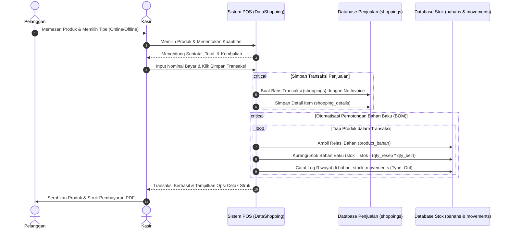

# Alur Inventaris & Transaksi Penjualan (Inventory & Sales Workflow)

Dokumen ini menjelaskan alur operasional inventaris bahan baku (*Master Bahan*), peracikan komposisi resep (*Bill of Materials*), transaksi penjualan kasir (*Point of Sale*), dan mekanisme otomatisasi pemotongan stok bahan.

---

## 1. Diagram Alur Transaksi & Mutasi Stok

---

## 2. Rincian Alur Master Bahan (*Raw Materials*)

### A. Konsep Satuan Beli vs Satuan Dasar (*Unit Conversion*)
Untuk mempermudah kasir dan manajer operasional:
1. **Satuan Pembelian (*Purchase Unit*)**: Satuan saat membeli bahan di pasar atau supplier (contoh: *kg, sak, liter, dus, pak, botol*).
2. **Satuan Dasar Pemakaian (*Base Unit*)**: Satuan terkecil yang digunakan saat meracik resep produk (contoh: *gram, ml, pcs*).
3. **Layanan Konversi (`UnitConversionService`)**:
   Sistem secara otomatis menghitung konversi stok masuk saat bahan baru diinput atau ditambah:
   - Misal: Input beli *2 Dus (@24 Pcs)* $\rightarrow$ Stok otomatis bertambah *48 Pcs*.
   - Misal: Input beli *5 Kilogram* $\rightarrow$ Stok otomatis bertambah *5.000 gram*.

### B. Jenis Mutasi Stok (*Stock Movements*)
Setiap perubahan stok tercatat secara transparan dengan tipe:
- `in`: Penambahan stok dari pembelian atau restock bahan baru.
- `out`: Pengurangan stok otomatis akibat transaksi penjualan produk di kasir.
- `adjustment_add` / `adjustment_sub`: Penyesuaian stok manual akibat selisih opname, bahan rusak (*waste*), atau tumpah.

---

## 3. Rincian Alur Produk & Komposisi Resep (BOM)

1. **Struktur Relasi Many-to-Many**:
   Tabel `products` terhubung ke tabel `bahans` melalui tabel perantara `product_bahan`:
   - `product_id`: ID produk.
   - `bahan_id`: ID bahan baku.
   - `quantity`: Jumlah bahan yang dibutuhkan per 1 porsi produk (dalam satuan dasar).
   - `unit`: Satuan pemakaian.

2. **Dukungan Multi-Harga (*Sales Type*)**:
   - `Offline`: Digunakan untuk transaksi di toko langsung.
   - `Online`: Digunakan untuk transaksi melalui platform online (GoFood, GrabFood, ShopeeFood) yang biasanya memiliki margin komisi aplikasi.
   - `All`: Memiliki konfigurasi harga offline dan harga online sekaligus.

---

## 4. Rincian Alur Checkout & Struk Penjualan

1. **Penomoran Invoice**:
   Sistem menghasilkan invoice unik otomatis:
   $$\text{INV} - \text{YYYYMMDD} - \text{Random/Urutan}$$
2. **Validasi Kembalian**:
   Sistem memastikan nominal pembayaran pelanggan tidak kurang dari total belanjaan.
3. **Cetak & Export Struk**:
   Tersedia tombol cetak langsung / download PDF menggunakan `App\Http\Controllers\Export\PdfController::struckShopping`.
